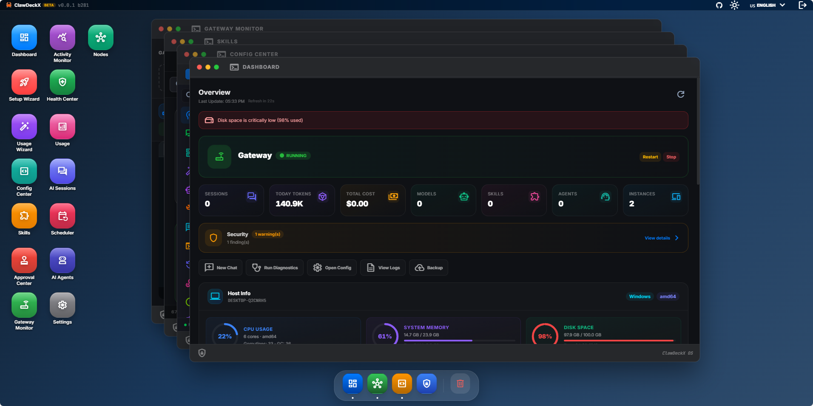
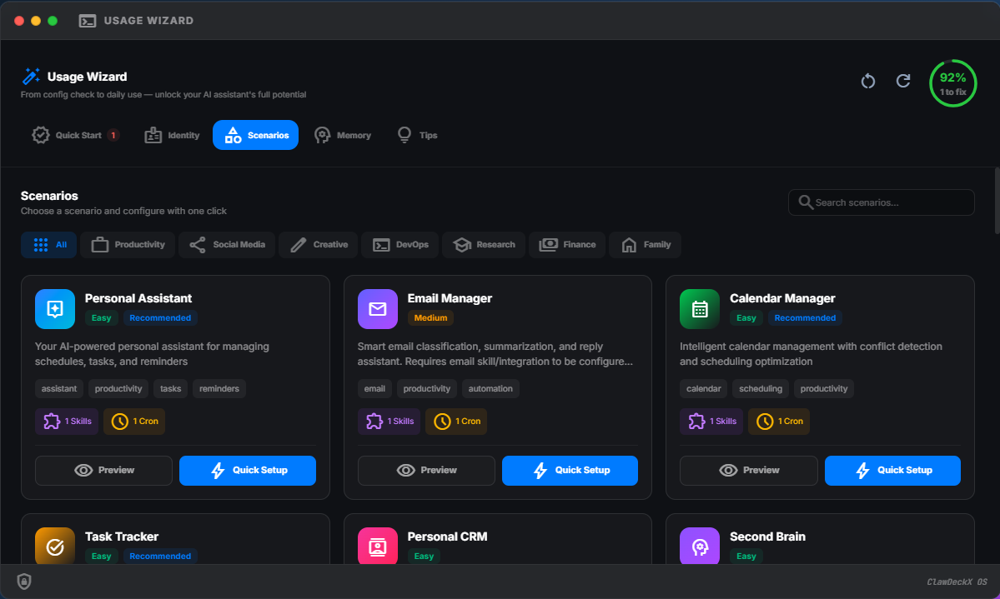
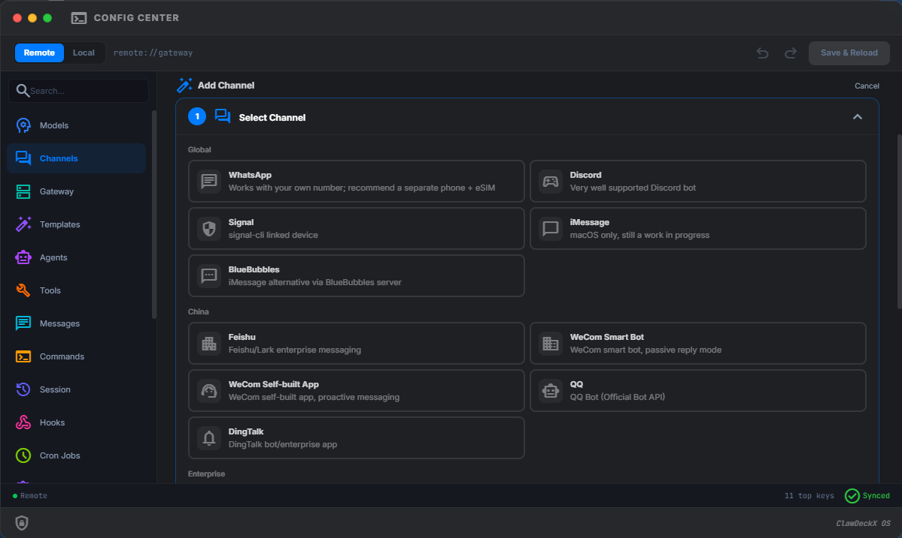

<div align="center">


<br/>

**Complexity within, simplicity without.**<br>
**繁于内，简于形。**

<br/>

[](https://github.com/haniakrim21/HAClaw-OS/releases)
[](https://github.com/haniakrim21/HAClaw-OS/actions)
[](https://github.com/haniakrim21/HAClaw-OS)
[](LICENSE)

English | [简体中文](README.zh-CN.md)

</div>

<br/>

> **HAClaw-OS** is an open-source web visual management platform built for [OpenClaw](https://github.com/openclaw/openclaw). It is designed to lower the barrier to entry, making installation, configuration, monitoring, and optimization simpler and more efficient, while providing a more accessible onboarding experience for users worldwide, especially beginners.

---

## ⚡ Highlights & Features

<table>
  <tr>
    <td width="50%" valign="top">
      <h3>💎 macOS-Grade UI</h3>
      <p>Faithfully recreates the macOS design language with refined glassmorphism, rounded cards, and smooth animation transitions. Managing AI agents feels as natural as using a native desktop app.</p>
    </td>
    <td width="50%" valign="top">
      <h3>🎯 Zero-Friction Setup</h3>
      <p>Guided wizards and pre-built templates let you complete OpenClaw's initial configuration and model setup without touching a single JSON file or terminal command.</p>
    </td>
  </tr>
  <tr>
    <td width="50%" valign="top">
      <h3>⚙️ Deep Config Editor</h3>
      <p>Fine-tune every OpenClaw parameter — model switching, memory management, plugin loading, channel routing — all through a beautiful visual editor.</p>
    </td>
    <td width="50%" valign="top">
      <h3>📊 Real-Time Observability</h3>
      <p>Built-in monitoring dashboard with live execution status, resource consumption, and task history providing full visibility into every agent's behavior.</p>
    </td>
  </tr>
  <tr>
    <td width="50%" valign="top">
      <h3>🌐 Native Cross-Platform</h3>
      <p>Single binary, zero dependencies. Runs natively on Windows, macOS (Intel & Apple Silicon), and Linux (amd64 & arm64). Just download and run.</p>
    </td>
    <td width="50%" valign="top">
      <h3>🔌 Gateway Control</h3>
      <p>Manage both local and remote OpenClaw gateways seamlessly. Switch between gateway profiles with one click — perfect for dev, staging, and production multi-environments.</p>
    </td>
  </tr>
</table>

<br/>

## 📸 Interface Preview

<div align="center">
  
  <p><i>Dashboard Overview</i></p>
</div>
<br/>
<div align="center">
  
  &nbsp;
  
  <p><i>Scenario Templates & Configuration Editor</i></p>
</div>

---

## 🚀 Quick Start

> [!CAUTION]
> **Beta Preview** — This is an early preview release. It has not undergone comprehensive testing. **Do not use in production environments.**

### 1️⃣ One-Click Install (Recommended)

The unified installer detects existing installations and lets you **install, update, manage, or uninstall** both Binary and Docker deployments from a single adaptive menu.

**macOS / Linux**
```bash
curl -fsSL https://raw.githubusercontent.com/haniakrim21/HAClaw-OS/main/install.sh | bash
```

**Windows (PowerShell)**
```powershell
irm https://raw.githubusercontent.com/haniakrim21/HAClaw-OS/main/install.ps1 | iex
```

### 2️⃣ Docker Compose

HAClaw-OS and OpenClaw run in the same container. OpenClaw is **preinstalled** in the official Docker image.

```bash
curl -fsSL https://raw.githubusercontent.com/haniakrim21/HAClaw-OS/main/docker-compose.yml -o docker-compose.yml
docker compose up -d
```
*Open your browser at `http://localhost:18700` (Docker) or `http://localhost:18788` (Native).*

<details>
<summary><b>🛠️ View Advanced Manual Installation Steps</b></summary>
<br>

Download from [Releases](https://github.com/haniakrim21/HAClaw-OS/releases). Single file, no dependencies. Just run.

```bash
# Run with default settings (localhost:18788)
./HAClaw-OS

# Specify port and bind address
./HAClaw-OS --port 18788 --bind 0.0.0.0

# Create initial admin user on first run
./HAClaw-OS --user admin --pass your_password
```

| Command | Usage | Description |
| :--- | :--- | :--- |
| `reset-password` | `HAClaw-OS reset-password <user> <pass>` | Reset a user's password |
| `reset-username` | `HAClaw-OS reset-username <old> <new>` | Change a user's username |
| `list-users` | `HAClaw-OS list-users` | List all registered users |
| `unlock` | `HAClaw-OS unlock <user>` | Unlock a locked user account |

</details>

---

## 🔋 Tech Stack Ecosystem

<div align="center">


</div>

<br/>

## 🤝 Contributing & Support

This project is open-source and licensed under the [MIT License](LICENSE) — free to use, modify, and distribute for both personal and commercial purposes!

If you run into any issues or have ideas for improvement, feel free to open an [Issue](https://github.com/haniakrim21/HAClaw-OS/issues) or submit a [Pull Request](https://github.com/haniakrim21/HAClaw-OS/pulls). Every piece of feedback helps this project grow.

---

<div align="center">
  [](https://star-history.com/#haniakrim21/HAClaw-OS&Date)
  <br><br>
  <b>Created By <a href="https://github.com/haniakrim21">Dr.Hani Akrim</a></b> &bull; Powered by OpenClaw<br>
  <sub><i>An AI predicted this project would go viral. But as we all know, AIs do hallucinate sometimes 😅</i></sub>
</div>
