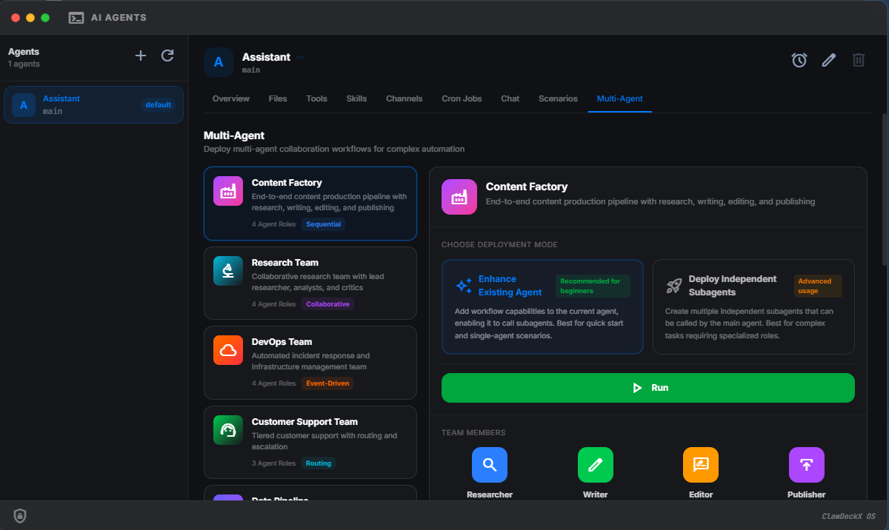

<div align="center">


# HAClaw-OS 🦀

**The Universal, MacOS-Inspired Web Desktop for Autonomous AI Agents**

<p><b>Created By Dr.Hani Akrim</b></p>

[](https://github.com/haniakrim21/HAClaw-OS/releases)
[](https://github.com/haniakrim21/HAClaw-OS)
[](LICENSE)

</div>

---

**HAClaw-OS** is an open-source, beautifully designed visual management platform tailored for the **OpenClaw** ecosystem. Crafted with a premium interface inspired by macOS, it lowers the barrier to entry for orchestrating AI agents, managing LLM models, and observing intelligent workflows. 

Whether you're an AI enthusiast, a developer, or a power user, HAClaw-OS brings a native desktop feel directly to your browser.

> [!CAUTION]
> **Beta Preview** — This is an early preview release actively being maintained. Do not use in critical production environments without prior testing.

<br>

## ✨ Why Choose HAClaw-OS?

| Feature | Description |
| :---: | :--- |
| 💎 **Pixel-Perfect UI** | Native macOS feel with stunning glassmorphism, fluid animations, and dark/light themes. |
| 🎛️ **Gateway Control** | Start, stop, and restart your AI Gateway instantly with real-time health monitoring. |
| 🖼 **Visual Configurator**| Edit configurations and tweak agent profiles without ever touching JSON or YAML files. |
| 🚀 **Next-Gen Models** | Out-of-the-box support for the newest powerhouse models like **Gemini 2.5 Pro** and **OpenAI o1**. |
| 🧩 **Template Center** | Deploy new agent personas and roles in seconds from built-in community templates. |
| 📊 **Live Dashboard** | Real-time system metrics, session tracking, and activity monitoring directly in the dock. |
| 🌍 **i18n Ready** | Ships with 13 built-in languages, easily extensible worldwide. |
| 📱 **Responsive Design**| Works seamlessly across 4K desktop monitors, tablets, and mobile devices. |

<br>

## 📸 Interface Preview

<div align="center">
  
  <p><sub>The Main Dashboard Overview</sub></p>
</div>

|  |  |
| :---: | :---: |
| *Scenario Templates* | *Multi-Agent Workflows* |

<br>

## 🚀 Quick Start (Docker Deployment)

We highly recommend utilizing Docker for the smoothest full-stack deployment. The bundled image includes HAClaw-OS, the OpenClaw Gateway, and all essential runtimes (Go, Python3, uv, ffmpeg, jq).

```bash
# 1. Download the docker-compose manifest
curl -fsSL https://raw.githubusercontent.com/haniakrim21/HAClaw-OS/main/docker-compose.yml -o docker-compose.yml

# 2. Deploy your personal OS in detached mode
docker compose up -d

# 3. Access your gateway
# Open your browser and navigate to http://localhost:18700
```

On your first run, HAClaw-OS will auto-generate a secure admin account. You can view your initial credentials by checking the container logs:
```bash
docker logs haclaw
```

<br>

## 🛠️ Tech Stack Architecture

**HAClaw-OS** runs independently as a high-performance single binary using state-of-the-art web technology.

| Layer | Technology | Details |
| :--- | :--- | :--- |
| **Backend** | Go (Golang) | Ultra-fast single-binary backend with zero runtime dependencies. |
| **Frontend** | React + Tailwind | Highly responsive, customizable interface with interactive physics. |
| **Database** | SQLite | Serverless flat-file SQL logic for ultra-fast portability. |
| **Real-time** | WebSocket + SSE | Low-latency bi-directional communication channels. |

<br>

## 🤝 Contributing

We welcome contributions wholeheartedly! Whether you're fixing bugs, adding new LLM support, optimizing the UI, or improving documentation, your help is appreciated. Submit a pull request or open an issue to start a discussion.

## 📄 License

This project is licensed under the [MIT License](LICENSE) — free to use, modify, and distribute for both personal and commercial purposes.

<div align="center">
  <sub>Created By <a href="https://github.com/haniakrim21">Dr.Hani Akrim</a> &bull; Powered by OpenClaw</sub>
</div>
