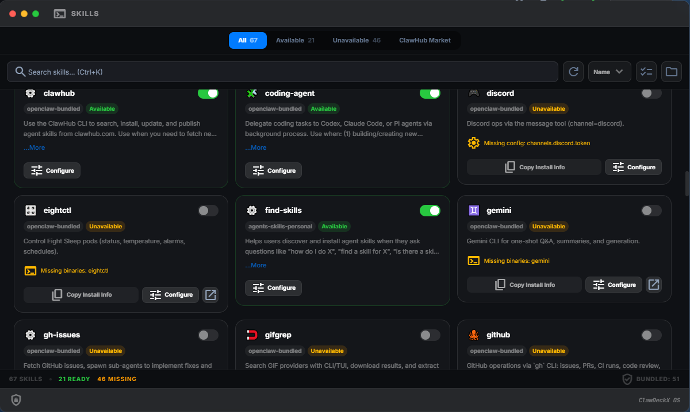

<div align="center">

# 🦞 HAClaw-OS

**Complexity within, simplicity without.**<br>
**繁于内，简于形。**

[](https://github.com/haniakrim21/HAClaw-OS/releases)
[](https://github.com/haniakrim21/HAClaw-OS/actions)
[](https://github.com/haniakrim21/HAClaw-OS)
[](LICENSE)

English | [简体中文](README.zh-CN.md)

---

**HAClaw-OS** is an open-source web visual management platform built for [OpenClaw](https://github.com/openclaw/openclaw). It is designed to lower the barrier to entry, making installation, configuration, monitoring, and optimization simpler and more efficient, while providing a more accessible onboarding experience for users worldwide, especially beginners.

</div>

> [!CAUTION]
> **Beta Preview** — This is an early preview release. It has not undergone comprehensive testing. **Do not use in production environments.**

---

## 📑 Table of Contents

- [✨ Why HAClaw-OS?](#-why-haclaw-os)
- [📸 Screenshots](#-screenshots)
- [🚀 Quick Start](#-quick-start)
- [🐋 Docker Install](#-docker-install)
- [🌟 Features](#-features)
- [🛠️ Tech Stack](#️-tech-stack)

---

## ✨ Why HAClaw-OS?

<details>
<summary><b>Click to reveal features</b></summary>

### 💻 macOS-Grade Visual Experience
The interface faithfully recreates the macOS design language — refined glassmorphism, rounded cards, and smooth animation transitions. Managing AI agents feels as natural as using a native desktop app.

### 🎯 Beginner-Friendly Setup
Guided wizards and pre-built templates let you complete OpenClaw's initial configuration and model setup without memorizing a single command.

### ⚙️ Deep Configuration
Fine-tune every OpenClaw parameter — model switching, memory management, plugin loading, channel routing — all through a beautiful visual editor.

### 📊 Real-Time Observability
Built-in monitoring dashboard with live execution status, resource consumption, and task history — full visibility into every agent's behavior.

### 🌐 Cross-Platform
Single binary, zero dependencies. Runs natively on Windows, macOS (Intel & Apple Silicon), and Linux (amd64 & arm64). Download and run — that's it.

### 📱 Responsive & Mobile-Ready
Fully responsive layout that adapts seamlessly from large desktop monitors to tablets and mobile phones. Manage your AI agents on the go — no compromise on functionality.

### 🗺️ Multilingual Support
Full i18n architecture with 13 built-in languages. Adding a new language requires only a translated JSON folder and a two-line code change.

### 🔌 Local & Remote Gateway
Seamlessly manage both local and remote OpenClaw gateways. Switch between gateway profiles with one click — perfect for multi-environment setups like dev, staging, and production.
</details>

---

## 📸 Screenshots

<div align="center">
  
  <p><i>Dashboard Overview</i></p>
</div>

<br>

<div align="center">
  
  &nbsp;
  
  <p><i>Scenario Templates &amp; Multi-Agent Workflow</i></p>
</div>

<br>

<div align="center">
  
  &nbsp;
  
  <p><i>Configuration Center &amp; Skills Center</i></p>
</div>

---

## 🚀 Quick Start

### Deployment Options

Choose the deployment method that best fits your needs:

#### 1️⃣ Local Deployment (Recommended)
Install HAClaw-OS on the same server as OpenClaw for full feature access and direct command execution.
*   **Advantages**: Full feature support, lower latency, no network dependency.

#### 2️⃣ Remote Gateway
Install HAClaw-OS on your local machine and connect to remote OpenClaw instances via WebSocket.
*   **Limitations**: Some CLI features are unavailable, depends on stable network connection.

---

### One-Click Install & Maintain

The unified installer detects existing installations and lets you **install, update, manage, or uninstall** both Binary and Docker deployments from a single adaptive menu.

**macOS / Linux**
```bash
curl -fsSL https://raw.githubusercontent.com/haniakrim21/HAClaw-OS/main/install.sh | bash
```

**Windows (PowerShell)**
```powershell
irm https://raw.githubusercontent.com/haniakrim21/HAClaw-OS/main/install.ps1 | iex
```

### Manual Download

Download from [Releases](https://github.com/haniakrim21/HAClaw-OS/releases). Single file, no dependencies. Just run.

```bash
# Run with default settings (localhost:18788)
./HAClaw-OS

# Specify port and bind address
./HAClaw-OS --port 18788 --bind 0.0.0.0

# Create initial admin user on first run
./HAClaw-OS --user admin --pass your_password
```

| Flag | Short | Description |
| :--- | :---: | :--- |
| `--port` | `-p` | Server port (default: `18788`) |
| `--bind` | `-b` | Bind address (default: `127.0.0.1`) |
| `--user` | `-u` | Initial admin username (first run only) |
| `--pass` | | Initial admin password (min 6 chars) |
| `--debug` | | Enable debug logging |

<details>
<summary><b>View CLI Commands for Account Recovery</b></summary>

| Command | Usage | Description |
| :--- | :--- | :--- |
| `reset-password` | `HAClaw-OS reset-password <user> <pass>` | Reset a user's password |
| `reset-username` | `HAClaw-OS reset-username <old> <new>` | Change a user's username |
| `list-users` | `HAClaw-OS list-users` | List all registered users |
| `unlock` | `HAClaw-OS unlock <user>` | Unlock a locked user account |

> [!TIP]
> **Forgot your credentials?** Run `HAClaw-OS list-users` to find your username, then `HAClaw-OS reset-password <username> <new_password>` to reset your password.
> If your password contains special characters (e.g. `!`, `$`, `#`, `&`), wrap it in **single quotes** to prevent shell interpretation: `HAClaw-OS reset-password admin 'P@ss!w0rd#$'`.

> [!WARNING]
> **Account lockout:** After **5** consecutive failed login attempts, the account is automatically locked for **15 minutes**. To unlock immediately, run `HAClaw-OS unlock <username>`.
</details>

---

## 🐋 Docker Install

> **Recommended:** Use the [one-click installer](#one-click-install--maintain) above — choose **Docker** when prompted. It handles download, port configuration, mirror detection, and shows credentials automatically.

**Manual method:**

```bash
curl -fsSL https://raw.githubusercontent.com/haniakrim21/HAClaw-OS/main/docker-compose.yml -o docker-compose.yml
docker compose up -d
```

Open your browser at `http://localhost:18700` (Docker) or `http://localhost:18788` (native). The first run will auto-generate an admin account — credentials will be shown in the container logs.

HAClaw-OS and OpenClaw run in the same container. OpenClaw is **preinstalled** in the official Docker image with version-pinned compatibility. On startup, the container entrypoint auto-starts the OpenClaw Gateway if a configuration file exists.

```bash
# View credentials
docker logs haclawx
```

<details>
<summary><b>View Docker Configuration Details</b></summary>

**Ports:**

| Port | Service | Description |
| :--- | :--- | :--- |
| `18700` → `18788` | HAClaw-OS Web UI | Main dashboard (host 18700 → container 18788) |
| `18789` | OpenClaw Gateway | Optional: expose for external debugging |

**Environment Variables:**

| Variable | Default | Description |
| :--- | :--- | :--- |
| `OPENCLAW_HOME` | `/data/openclaw/home` | OpenClaw home root override |
| `OPENCLAW_STATE_DIR` | `/data/openclaw/state` | OpenClaw state directory |
| `OPENCLAW_CONFIG_PATH` | `/data/openclaw/state/openclaw.json` | OpenClaw config file path |
| `OCD_DB_SQLITE_PATH` | `/data/haclawx/HAClaw-OS.db` | HAClaw-OS SQLite database path |
| `OCD_LOG_FILE` | `/data/haclawx/HAClaw-OS.log` | HAClaw-OS server log path |
| `OCD_OPENCLAW_GATEWAY_HOST` | `127.0.0.1` | Gateway host address |
| `OCD_OPENCLAW_GATEWAY_PORT` | `18789` | Gateway port |

**Volumes:**

| Volume | Mount Point | Description |
| :--- | :--- | :--- |
| `haclawx-data` | `/data/haclawx` | HAClaw-OS database and app logs |
| `haclawx-openclaw-data` | `/data/openclaw` | OpenClaw config, state, logs, and user-installed upgrades |
</details>

---

## 🌟 Features

| ✨ | Feature | Description |
| :---: | :--- | :--- |
| 💎 | **Pixel-Perfect UI** | Native macOS feel with glassmorphism, smooth animations, dark/light themes |
| 🎛️ | **Gateway Control** | Start, stop, restart your Gateway instantly with real-time health monitoring |
| 🖼 | **Visual Config Editor** | Edit configurations and agent profiles without touching JSON/YAML |
| 🧙 | **Setup Wizard** | Step-by-step guided setup for first-time users |
| 🧩 | **Template Center** | Deploy new agent personas in seconds with built-in templates |
| 📊 | **Live Dashboard** | Real-time metrics, session tracking, and activity monitoring |
| 🛡️ | **Security Built-in** | JWT auth, HttpOnly cookies, and alert system from day one |
| 🌍 | **i18n Ready** | 13 built-in languages, easily extensible |

---

## 🛠️ Tech Stack

<div align="center">


</div>

---

## 🤝 Contributing & License

This project is licensed under the [MIT License](LICENSE) — free to use, modify, and distribute for both personal and commercial purposes.

We welcome contributions! Whether you're fixing bugs, adding features, or improving documentation, your help is appreciated. Feel free to open an [Issue](https://github.com/haniakrim21/HAClaw-OS/issues) or submit a [Pull Request](https://github.com/haniakrim21/HAClaw-OS/pulls).

---

## ⭐ Star History

[](https://star-history.com/#haniakrim21/HAClaw-OS&Date)

<br>

<div align="center">
  <sub>Created By <a href="https://github.com/haniakrim21">Dr.Hani Akrim</a> &bull; Powered by OpenClaw</sub><br>
  <sub><i>An AI predicted this project would go viral. But as we all know, AIs do hallucinate sometimes 😅</i></sub>
</div>
